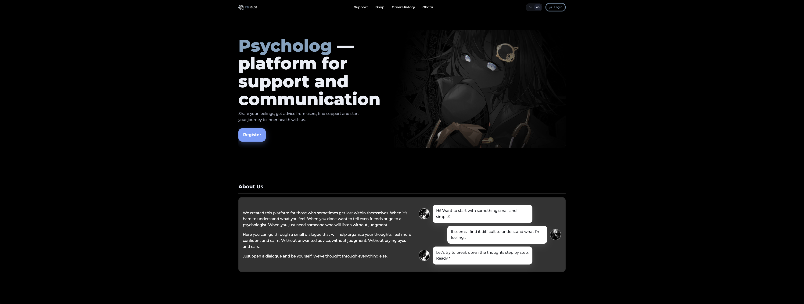
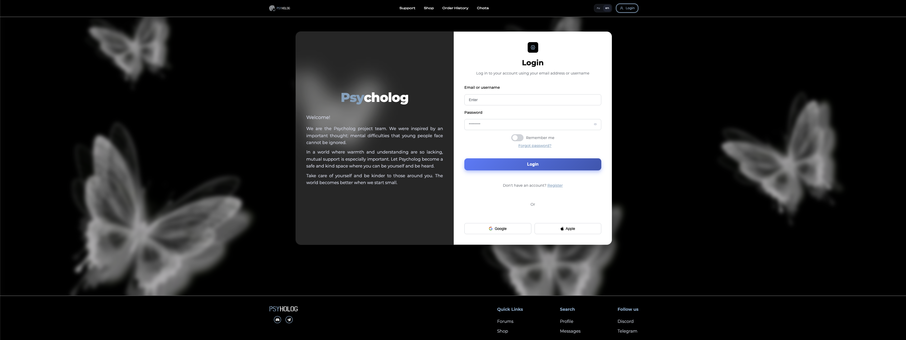
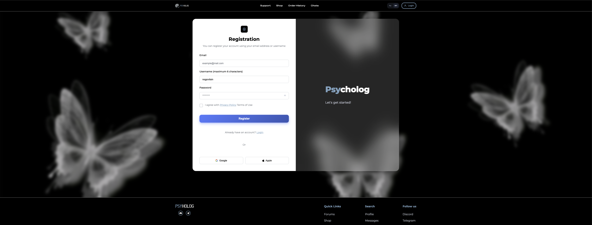
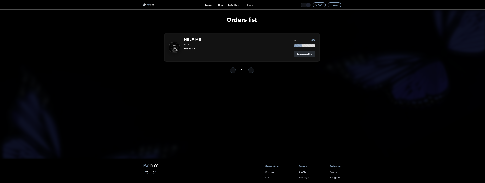
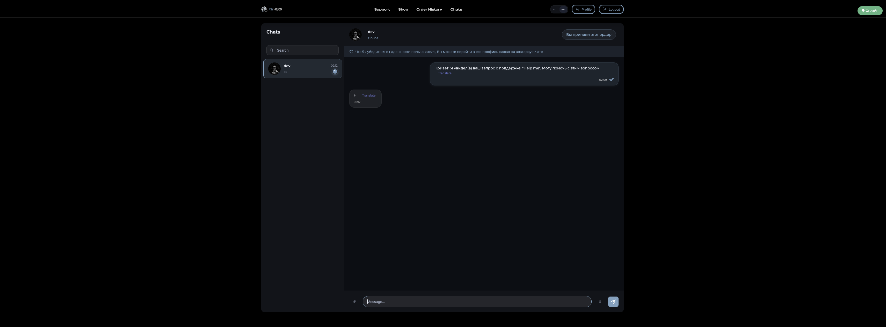
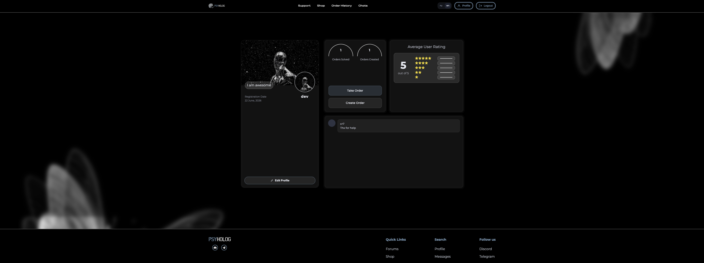
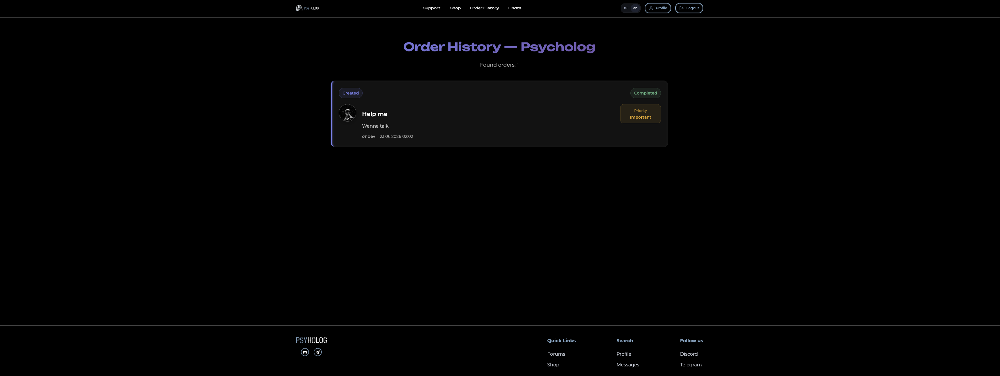
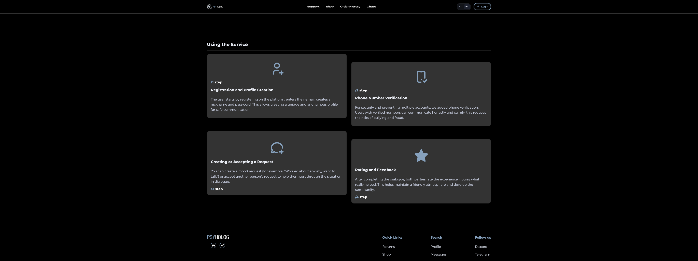

# PSYhoglog
Web platform connecting users seeking support with volunteers willing to help

Status: In Development

MAIN IDEA its a peer-to-peer support web platform that helps people find other users who are ready to listen, support, or share their own experiences in difficult life situations.

Technologies
    PHP
    JavaScript
    CSS
    MySQL
    Git 

Implemented functionality:
    User registration and authorization
    Editing user profile
    Creating and accepting orders
    Internal chat between users
    User rating system
    Feedback and comments
    Order history
    Request status management
    
Planned Features
    Automatic real-time translation of messages between users with different interface languages.
    Send and receive files directly in the chat.
    Voice messages with the ability to listen within the platform.
    Push notifications and email notifications about new messages and requests.
    User complaints and moderation system.
    Advanced rating and reputation system.
    Search and filter requests by category and level of urgency.
    List of friends and favorite users.
    User statuses (online, offline, busy).
    Ability to create requests anonymously.
    Admin panel for managing users, complaints and platform content.

## Screenshots

## Login

## Registration

## Orders List

Users can create support requests and accept requests from other users.

## Internal Chat

Built-in messaging system for communication between users.

## User Profile

Profile page with statistics, ratings and comments.

## Order History

History of completed and created requests.

## Additional Screenshots

